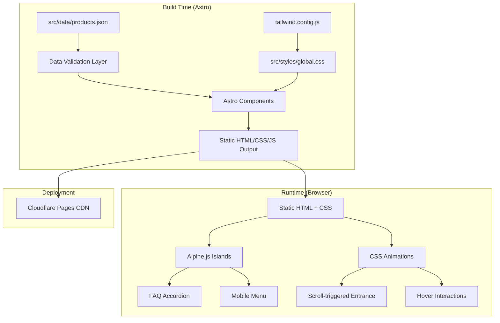
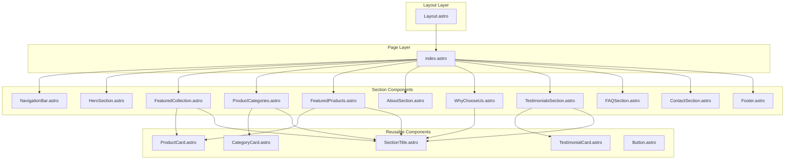
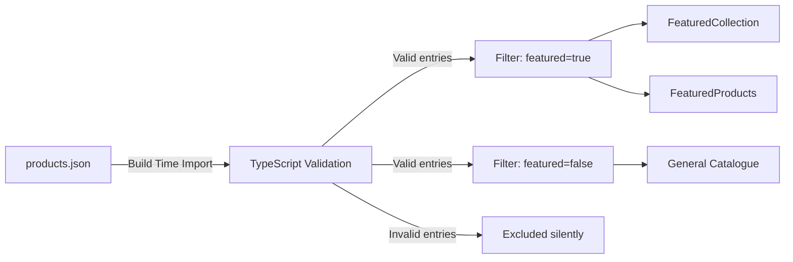

# Design Document

## Overview

This design describes a premium one-page digital catalogue website for the Southern Community Orthopedic Triage Service (SCOTS). The site is a fully static, server-rendered Astro application styled with Tailwind CSS, with minimal client-side interactivity provided by Alpine.js for the FAQ accordion and mobile navigation menu.

The architecture prioritises performance (target: Lighthouse 100 across all categories), accessibility (WCAG 2.1 AA), and developer experience. All content is driven by a single JSON data file, enabling non-developer content updates without touching component code.

**Key Design Decisions:**
- **Static-first**: Astro's static output mode generates pure HTML/CSS at build time. No SSR runtime needed.
- **Zero-JS by default**: Components ship zero JavaScript unless explicitly opted-in via Alpine.js islands.
- **Data-driven rendering**: A single `src/data/products.json` file drives all service card rendering at build time.
- **CSS-only animations**: All motion effects use CSS transitions/animations — no JS animation libraries.
- **Responsive grid system**: Tailwind's responsive utilities handle all breakpoint logic declaratively.

## Architecture

### High-Level Architecture



### Component Architecture



### Data Flow



## Components and Interfaces

### Layout Component

**File:** `src/layouts/Layout.astro`

```typescript
interface LayoutProps {
  title: string;
  description: string;
  ogImage?: string;
  canonicalUrl?: string;
}
```

Responsibilities:
- HTML document shell (`<!DOCTYPE html>`, `<html>`, `<head>`, `<body>`)
- Meta tags (SEO, Open Graph, Twitter Cards)
- Font preloading (Inter family)
- Global CSS import
- JSON-LD structured data injection
- Slot for page content

### Navigation Bar Component

**File:** `src/components/NavigationBar.astro`

```typescript
interface NavLink {
  label: string;
  href: string; // e.g., "#featured", "#about"
}

interface NavigationBarProps {
  links: NavLink[];
  logoText: string;
}
```

Responsibilities:
- Sticky positioning with transparent-to-solid background transition (CSS-only using scroll-driven styles or a minimal Alpine.js `x-data` for scroll detection)
- Desktop horizontal link list
- Mobile hamburger menu (Alpine.js `x-data` for toggle state)
- Active section highlighting via Intersection Observer (inline `<script>` in Astro)
- Keyboard navigation support
- ARIA landmarks and labels

**Alpine.js Usage (Mobile Menu):**
```html
<nav x-data="{ open: false }" aria-label="Main navigation">
  <button @click="open = !open" :aria-expanded="open" aria-controls="mobile-menu">
    <!-- Hamburger icon -->
  </button>
  <div id="mobile-menu" x-show="open" x-transition>
    <!-- Mobile links -->
  </div>
</nav>
```

### Section Title Component

**File:** `src/components/SectionTitle.astro`

```typescript
interface SectionTitleProps {
  title: string;
  subtitle?: string;
  alignment?: 'left' | 'center';
  headingLevel?: 2 | 3 | 4;
}
```

### Product Card Component

**File:** `src/components/ProductCard.astro`

```typescript
interface ProductCardProps {
  id: string;
  name: string;
  description: string;
  category: string;
  image: string;
  badge: string;
  featured: boolean;
}
```

Responsibilities:
- Responsive card with image (lazy-loaded, explicit dimensions)
- Truncated description (max 120 characters with ellipsis via CSS `line-clamp`)
- Category badge
- "Learn More" call-to-action button
- Hover lift animation (CSS transition)

### Category Card Component

**File:** `src/components/CategoryCard.astro`

```typescript
interface CategoryCardProps {
  icon: string; // SVG icon identifier or path
  title: string;
  description: string;
  iconLabel: string; // Accessible label for the icon
}
```

### Testimonial Card Component

**File:** `src/components/TestimonialCard.astro`

```typescript
interface TestimonialCardProps {
  name: string;
  reviewText: string;
  rating: 1 | 2 | 3 | 4 | 5;
  avatarUrl?: string;
}
```

### FAQ Accordion Component

**File:** `src/components/FAQSection.astro`

```typescript
interface FAQItem {
  question: string;
  answer: string;
}

interface FAQSectionProps {
  items: FAQItem[];
}
```

**Alpine.js Usage (Single-open Accordion):**
```html
<div x-data="{ activeIndex: null }">
  <template x-for="(item, index) in items">
    <div>
      <button 
        @click="activeIndex = activeIndex === index ? null : index"
        :aria-expanded="activeIndex === index"
        :aria-controls="`faq-panel-${index}`"
        @keydown.enter="activeIndex = activeIndex === index ? null : index"
        @keydown.space.prevent="activeIndex = activeIndex === index ? null : index"
      >
        <!-- Question text + chevron icon -->
      </button>
      <div 
        :id="`faq-panel-${index}`"
        x-show="activeIndex === index"
        x-transition:enter="transition ease-out duration-200"
        x-transition:enter-start="opacity-0 -translate-y-1"
        x-transition:enter-end="opacity-100 translate-y-0"
        x-transition:leave="transition ease-in duration-200"
        x-transition:leave-start="opacity-100 translate-y-0"
        x-transition:leave-end="opacity-0 -translate-y-1"
        role="region"
      >
        <!-- Answer content -->
      </div>
    </div>
  </template>
</div>
```

**Reduced Motion Support:**
The Alpine.js transitions are supplemented with a CSS media query:
```css
@media (prefers-reduced-motion: reduce) {
  [x-transition] {
    transition-duration: 0ms !important;
  }
}
```

### Button Component

**File:** `src/components/Button.astro`

```typescript
interface ButtonProps {
  variant: 'primary' | 'secondary' | 'outline';
  href?: string;
  size?: 'sm' | 'md' | 'lg';
  fullWidth?: boolean;
  ariaLabel?: string;
}
```

### Hero Section Component

**File:** `src/components/HeroSection.astro`

```typescript
interface HeroSectionProps {
  headline: string;
  supportingText: string;
  primaryCta: { label: string; href: string };
  secondaryCta: { label: string; href: string };
  heroImage: { src: string; alt: string; width: number; height: number };
}
```

### Contact Section Component

**File:** `src/components/ContactSection.astro`

```typescript
interface ContactInfo {
  email: string;
  phone: string;
  address: string;
  locations: string[];
  socialLinks: { platform: string; url: string; icon: string }[];
  ctaButton: { label: string; href: string };
}
```

### Footer Component

**File:** `src/components/Footer.astro`

```typescript
interface FooterProps {
  navLinks: { label: string; href: string }[];
  socialLinks: { platform: string; url: string; icon: string }[];
  legalLinks: { label: string; href: string }[];
}
```

## Data Models

### Product/Service Data Schema

**File:** `src/data/products.json`

```typescript
interface Product {
  id: string;          // Unique identifier, e.g., "ortho-assessment-initial"
  name: string;        // Max 100 characters
  description: string; // Max 500 characters
  category: string;    // One of: "Assessment", "Rehabilitation", "Education", "Consultation"
  image: string;       // Relative path or URL to image
  badge: string;       // Display badge text, e.g., "New", "Popular"
  featured: boolean;   // Whether to show in featured sections
}

type ProductsData = Product[];
```

**Example Entry:**
```json
{
  "id": "initial-assessment",
  "name": "Initial Orthopedic Assessment",
  "description": "Comprehensive musculoskeletal assessment by experienced physiotherapists and nurse practitioners to determine the most appropriate care pathway.",
  "category": "Assessment",
  "image": "/assets/images/assessment.webp",
  "badge": "Core Service",
  "featured": true
}
```

### Data Validation Utility

**File:** `src/utils/validateProducts.ts`

```typescript
interface ValidationResult {
  valid: Product[];
  invalid: { entry: unknown; reason: string }[];
}

function validateProducts(data: unknown): ValidationResult;
```

This utility:
1. Checks that input is an array
2. Validates each entry has all required fields with correct types
3. Validates string length constraints (name ≤ 100, description ≤ 500)
4. Returns separate arrays of valid and invalid entries
5. Invalid entries are excluded from rendering (Requirement 15.5)

### FAQ Data

**File:** `src/data/faq.json`

```typescript
interface FAQItem {
  question: string;
  answer: string;
}

type FAQData = FAQItem[];
```

### Testimonials Data

**File:** `src/data/testimonials.json`

```typescript
interface Testimonial {
  name: string;      // Max 50 characters
  reviewText: string; // Full text (truncated in display at 200 chars)
  rating: number;    // 1-5
  avatarUrl?: string;
}

type TestimonialsData = Testimonial[];
```

### Site Configuration

**File:** `src/data/site-config.ts`

```typescript
interface SiteConfig {
  siteName: string;
  siteUrl: string;
  title: string;        // Max 60 characters
  description: string;  // Max 160 characters
  ogImage: string;
  contact: {
    email: string;
    phone: string;
    address: string;
  };
  locations: string[];
  socialLinks: { platform: string; url: string; icon: string }[];
  navigation: { label: string; href: string }[];
}
```

## Correctness Properties

*A property is a characteristic or behavior that should hold true across all valid executions of a system — essentially, a formal statement about what the system should do. Properties serve as the bridge between human-readable specifications and machine-verifiable correctness guarantees.*

### Property 1: Data validation round-trip integrity

*For any* valid Product object (with all required fields within length constraints), passing it through the validation function SHALL return it in the valid array unchanged, and the valid array SHALL not contain any entries with missing or out-of-bounds fields.

**Validates: Requirements 15.2, 15.5**

### Property 2: Invalid entry exclusion

*For any* object that is missing one or more required fields (id, name, description, category, image, badge, or featured) OR has a name exceeding 100 characters OR has a description exceeding 500 characters, the validation function SHALL place it in the invalid array and SHALL NOT include it in the valid array.

**Validates: Requirements 15.2, 15.5**

### Property 3: Featured filtering correctness

*For any* set of validated products, filtering for `featured === true` SHALL return only products where the featured field is true, and filtering for `featured === false` SHALL return only products where the featured field is false. The union of both filtered sets SHALL equal the original set, and the featured set SHALL contain at most 6 items when used for rendering.

**Validates: Requirements 6.2, 8.3, 15.4, 15.6**

### Property 4: Text truncation preserves prefix

*For any* string and a given maximum length threshold, if the string exceeds that threshold the truncation function SHALL return a string whose visible text is a prefix of the original (of exactly threshold length) followed by an ellipsis indicator. If the string is at or below the threshold, it SHALL be returned unchanged.

**Validates: Requirements 6.4, 8.2, 11.4**

## Error Handling

### Build-Time Errors

| Error Condition | Handling Strategy |
|---|---|
| `products.json` malformed (not valid JSON) | Astro build fails with clear error message pointing to the file |
| Product entry missing required fields | Entry excluded from rendering; build succeeds with remaining valid entries |
| Image file referenced but missing | Build succeeds; browser shows fallback placeholder at runtime |
| TypeScript type errors | Build fails in strict mode; developer must fix before deploy |

### Runtime Errors

| Error Condition | Handling Strategy |
|---|---|
| Hero image fails to load | CSS fallback background colour displayed; content remains readable |
| Product card image fails to load | Placeholder div with alt text displayed at correct dimensions |
| Font fails to load within 3 seconds | System sans-serif fallback renders immediately via `font-display: swap` |
| Alpine.js fails to load | FAQ items remain collapsed (progressive enhancement); mobile menu falls back to CSS-only solution using `:target` or checkbox hack |
| CSS animations not supported | Content displays without animation (graceful degradation) |

### Progressive Enhancement Strategy

The site follows progressive enhancement:
1. **HTML layer**: All content is readable without CSS or JS
2. **CSS layer**: Layout, styling, and CSS-only animations enhance appearance
3. **JS layer (Alpine.js)**: FAQ toggle and mobile menu add interactivity

If JavaScript is disabled:
- FAQ answers can be made visible by default using `<noscript>` style overrides
- Mobile navigation can use a CSS-only toggle pattern as fallback

## Testing Strategy

### Unit Tests

**Framework:** Vitest (aligned with Astro's recommended testing setup)

Unit tests cover:
- **Data validation**: `validateProducts()` with various valid/invalid inputs
- **Truncation utility**: String truncation at 120 characters with ellipsis
- **Data filtering**: Featured/non-featured product separation
- **Type guards**: TypeScript type narrowing for Product interface

### Property-Based Tests

**Framework:** fast-check (with Vitest)

Property tests validate the 4 correctness properties defined above:
- Property 1: Generate random valid Product objects, verify they pass through validation unchanged
- Property 2: Generate random objects with missing fields or constraint violations, verify exclusion
- Property 3: Generate random product arrays, verify featured filtering returns only featured=true items (max 6) and set union is preserved
- Property 4: Generate random strings of varying lengths and thresholds, verify truncation preserves prefix and appends ellipsis only when needed
- Minimum 100 iterations per property test

**Configuration:**
```typescript
import fc from 'fast-check';

// Each property test runs 100+ iterations
fc.assert(fc.property(
  productArbitrary,
  (product) => { /* property assertion */ }
), { numRuns: 100 });
```

**Test tagging format:**
```typescript
// Feature: digital-catalogue, Property 1: Data validation round-trip integrity
```

### Integration/E2E Tests

**Framework:** Playwright

Integration tests cover:
- Navigation smooth-scrolling between sections
- Mobile menu open/close behaviour
- FAQ accordion expand/collapse (single-open constraint)
- Responsive layout at key breakpoints (320px, 768px, 1024px, 1440px)
- Image lazy loading below the fold
- `prefers-reduced-motion` animation suppression

### Accessibility Tests

**Tools:** axe-core (via @axe-core/playwright), Lighthouse CI

- Automated WCAG 2.1 AA checks on built pages
- Keyboard navigation flow testing
- Screen reader announcement verification for dynamic content
- Colour contrast ratio validation

### Performance Tests

**Tool:** Lighthouse CI in CI pipeline

- Performance score ≥ 100
- Accessibility score ≥ 100
- Best Practices score ≥ 100
- SEO score ≥ 100
- Total JS bundle ≤ 50KB compressed
- CLS ≤ 0.1

### Build Verification

- `npm run build` exits with code 0
- Output in `dist/` contains index.html, robots.txt, sitemap.xml
- No TypeScript errors in strict mode
- All referenced images exist in output

### Test Organisation

```
tests/
├── unit/
│   ├── validateProducts.test.ts
│   ├── truncateText.test.ts
│   └── filterProducts.test.ts
├── property/
│   ├── validation-roundtrip.property.test.ts
│   ├── invalid-exclusion.property.test.ts
│   ├── featured-filtering.property.test.ts
│   └── truncation.property.test.ts
├── e2e/
│   ├── navigation.spec.ts
│   ├── faq.spec.ts
│   ├── responsive.spec.ts
│   └── accessibility.spec.ts
└── lighthouse/
    └── performance.spec.ts
```
